Grammar reference
=================

This page is here to serve as a reference for the grammar implementation. Baron
started as a python2.7 grammar implementation following `the official
specification for that <https://docs.python.org/2/reference/grammar.html>`_ and
supporting both :file:`print statement` and :file:`print function`.

The evolution path regarding python3* is the adopt the same strategy that
lib2to3 and try to support a combination of both grammar as much as possible.

This page describe the decisions taken regarding this dual support and it's
progress. Hopefully there will be very few conflicting situations.

Current goal is `python 3.6 specification <https://docs.python.org/3.6/reference/grammar.html>`_.

Python 2 and python 3.6 grammar differences
===========================================

As a reference and an overview, here is screenshot of vimdiff showing the difference between python 2.7 and python 3.6 grammar differences.

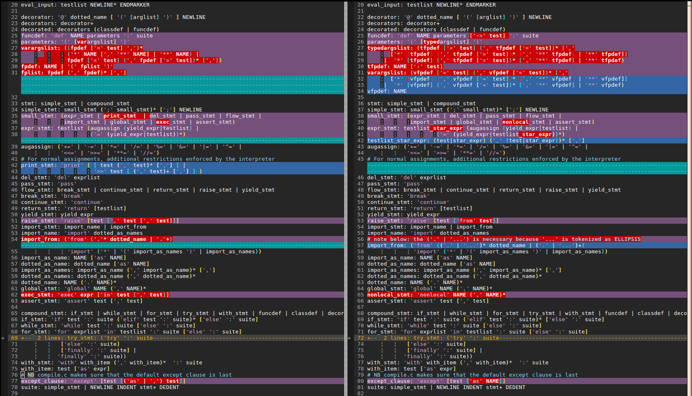

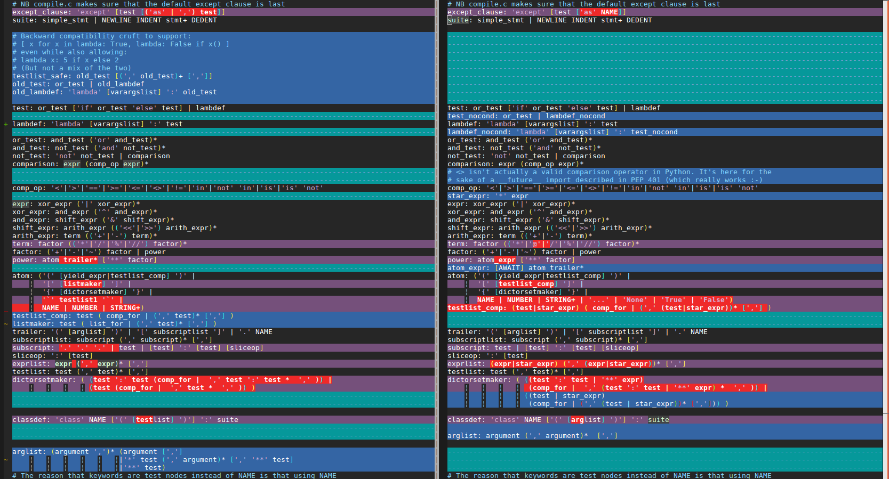

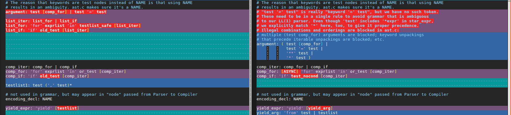

List of differences
===================

**Some of the diff have been edited to isolate the focused difference of the
section**

Python 3.3 is the based grammar I've started diffing with, some of the grammar
differences marked as 3.3 are actually from older python version.

Current status
==============

Grammar diff has been done up to python 3.6.2.

Still, some stuff for the lexer are probably missing in this list like:

* fstrings
* adding _ in numbers

I need to got through all release notes to see that.

Done
====

Print function
--------------

Python 3.3 or earlier

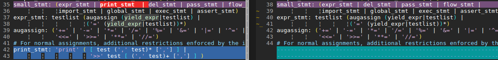

Already done since the start.

This is handle at the parser initialisation level, is activate or not the
print_function rule.

Ellipsis as atom (to replace 'pass')
------------------------------------

Python 3.3 or earlier
RedBaron: probably nothing to do (to be confirmed)

Baron: https://github.com/PyCQA/baron/pull/121

::

    ADD '...' in atom rule

Matrix operator
---------------

Python 3.5

Baron: https://github.com/PyCQA/baron/pull/117
RedBaron: probably nothing to do (to be confirmed)

::

    ADD '@' and '@=' to the lexer
    ADD '@=' in augassign
    ADD '@' in term

::

    augassign: ('+=' | '-=' | '*=' | '@=' | '/=' | '%=' | '&=' | '|=' | '^=' |
                '<<=' | '>>=' | '**=' | '//=')

    term: factor (('*'|'@'|'/'|'%'|'//') factor)*

f-strings
---------

Python 3.6

Baron: https://github.com/PyCQA/baron/pull/110
RedBaron: TODO

::

    add f'' rf'' fr'' to the lexer

Underscore in numeric literals
------------------------------

Python 3.6

Baron: https://github.com/PyCQA/baron/pull/111
RedBaron: probably nothing to do (to be confirmed)

::

    modify lexer to handle this

Nonlocal statement
------------------

Python 3.3 or earlier

Baron: https://github.com/PyCQA/baron/pull/112
RedBaron: TODO

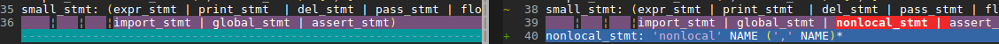

Action:

::

    ADD 'nonlocal' to lexer
    ADD 'nonlocal_stmt' to 'small_stmt'

    ADD new rule:
    nonlocal_stmt: 'nonlocal' NAME (',' NAME)*

Kwargs only arguments
---------------------

Python 3.0

PEP: https://www.python.org/dev/peps/pep-3102/
Baron: https://github.com/PyCQA/baron/pull/108
RedBaron: TODO

Action:

::

    ADD new rule:
    parameter : STAR

Yield From
----------

Python 3.3 or earlier

PEP 380
Baron: https://github.com/PyCQA/baron/pull/113 and some after work (spliting in 2 nodes, fixing testlist → test, ...)
RedBaron: TODO

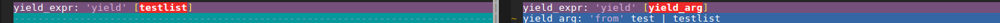

Action:

::

    ADD new node yield_from
    Implement grammar from the screenshot

Await atom
----------

Python 3.5

PEP 492
Baron: https://github.com/PyCQA/baron/pull/114
RedBaron: TODO

Before:

::

    power: atom trailer* ['**' factor]

After:

::

    power: atom_expr ['**' factor]
    atom_expr: [AWAIT] atom trailer*

**await is a NAME here, not a keyword** (because you can do `await = 42`.)

Async Funcdef
-------------

Python 3.5
PEP 492
Baron: https://github.com/PyCQA/baron/pull/114
RedBaron: TODO

Before:

::

    decorated: decorators (classdef | funcdef)

After:

::

    decorated: decorators (classdef | funcdef | async_funcdef)
    async_funcdef: ASYNC funcdef

**async is a NAME here, not a keyword** (because you can do `async = 42`.)

async for loop
--------------

Python 3.6

Before:

Baron: https://github.com/PyCQA/baron/pull/114
RedBaron: TODO

::

    comp_for: 'for' exprlist 'in' or_test [comp_iter]

After:

::

    async: NAME [SPACE]  # where NAME == "async"
    async_stmt: async for_stmt

**async is a NAME here, not a keyword** (because you can do `async = 42`.)

async with
----------

Python 3.6

Before:

Baron: https://github.com/PyCQA/baron/pull/114
RedBaron: TODO

::

    with_stmt: 'with' with_item (',' with_item)*  ':' suite

After:

::

    async: NAME [SPACE]  # where NAME == "async"
    async_stmt: async with_stmt

**async is a NAME here, not a keyword** (because you can do `async = 42`.)

Ellipsis in from import
-----------------------

Python 3.3 or earlier

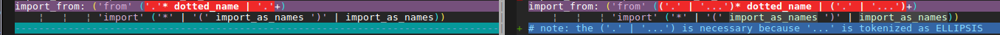

Function return type
--------------------

Python 3.3 or earlier

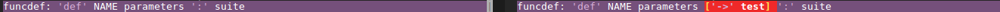

Action:

::

    ADD '->' to the lexer
    ADD ['->' test] to funcdef rule
    funcdef: 'def' NAME parameters ['->' test] ':' suite

Exec function
-------------

Python 3.3 or earlier

Like print_function but for 'exec'.

No one seems to be using that.

Typed arguments
---------------

Python 3.3 or earlier

Baron: https://github.com/PyCQA/baron/pull/140
RedBaron: Done

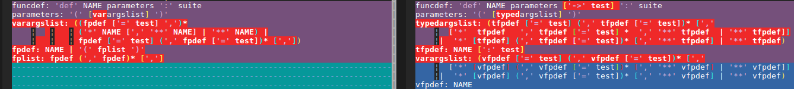

Action:

::

    # parameters
    # this is mixed with the removal of def a((b, c)): style
    # which will probably need to continue supporting

    CHANGE parameters: '(' [varargslist] ')'
                               ^
    TO parameters: '(' [typedargslist] ')'
                             ^

::

    # CHANGE
    varargslist:
       (
          (fpdef ['=' test] ',')*
          (
             '*' NAME [',' '**' NAME]
          |
             '**' NAME
          )
       |
          fpdef ['=' test]
          (',' fpdef ['=' test])*
          [',']
       )

    fpdef: NAME | '(' fplist ')'
    fplist: fpdef (',' fpdef)* [',']

    # TO
    typedargslist:
       (
          tfpdef ['=' test]
          (',' tfpdef ['=' test])*
          [
             ','
             [
                '*' [tfpdef]
                (',' tfpdef ['=' test])*
                [',' ['**' tfpdef [',']]]
             |
                '**' tfpdef [',']
             ]
          ]
       |
          '*' [tfpdef]
          (',' tfpdef ['=' test])*
          [',' ['**' tfpdef [',']]]
       |
          '**' tfpdef [',']
       )

    # after some analysis, this is just a refactoring of the previous form with
    # fpdef being changed to vfpdef
    varargslist:
       (
          vfpdef ['=' test]
          (',' vfpdef ['=' test])*
          [
             ','
             [
                '*' [vfpdef]
                (',' vfpdef ['=' test])*
                [',' ['**' vfpdef [',']]]
             |
                '**' vfpdef [',']
             ]
          ]
       |
          '*' [vfpdef]
          (',' vfpdef ['=' test])*
          [',' ['**' vfpdef [',']]]
       |
          '**' vfpdef [',']
       )

    tfpdef: NAME [':' test]

    vfpdef: NAME

*var generalisation
-------------------

Python 3.3 or earlier

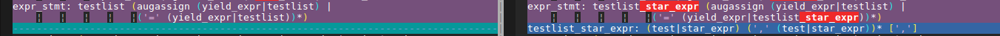

.

.

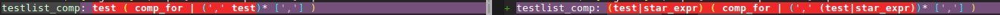

.

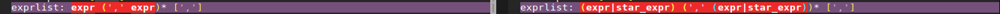

No more '.' '.' '.' in the grammar
----------------------------------

Python 3.3 or earlier

Inheritance in class definition uses arglist now
------------------------------------------------

Python 3.3 or earlier

I have no idea on why this is here but that's easy to change.

Raise from
----------

Python 3.3 or earlier

Action:

::

    # 2.7
    raise_stmt: 'raise' [test [',' test [',' test]]]

    # 3.3
    raise_stmt: 'raise' [test ['from' test]]

    # merge
    raise_stmt: 'raise' [test [(',' test [',' test]] | 'from' test)]

Variables annotations
---------------------

Python 3.6

Before:

::

    expr_stmt: testlist_star_expr (augassign (yield_expr|testlist) |
                         ('=' (yield_expr|testlist_star_expr))*)

After:

::

    expr_stmt: testlist_star_expr (annassign | augassign (yield_expr|testlist) |
                         ('=' (yield_expr|testlist_star_expr))*)
    annassign: ':' test ['=' test]

TODO
====

New lambda grammar
------------------

Python 3.3 or earlier

I have no idea on what to do with this one yet.

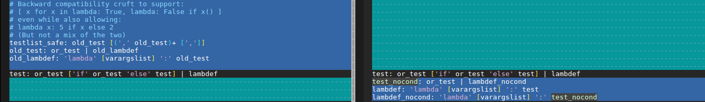

Remove old list comprehension syntax
------------------------------------

Python 3.3 or earlier

I'm not sure on how to handle both situations (and it is needed? Old list
comprehension syntax is like super edgy, I really wonder if anyonne has
actually used that one that?)

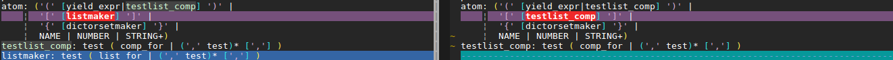

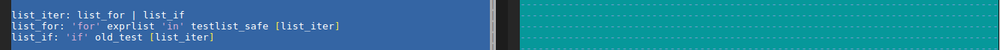

False|True|None|... are now atoms in the grammar
------------------------------------------------

Python 3.3 or earlier

Do I need to do anything about that?

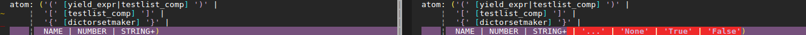

Kwargs expressions
------------------

Python 3.5

Partially done with kwargs only arguments.

Before:

::

    dictorsetmaker: ( (test ':' test (comp_for | (',' test ':' test)* [','])) |
                      (test (comp_for | (',' test)* [','])) )

    arglist: (argument ',')* (argument [',']
                             |'*' test (',' argument)* [',' '**' test]
                             |'**' test)

    # The reason that keywords are test nodes instead of NAME is that using NAME
    # results in an ambiguity. ast.c makes sure it's a NAME.
    argument: test [comp_for] | test '=' test

After:

::

    dictorsetmaker: ( ((test ':' test | '**' expr)
                       (comp_for | (',' (test ':' test | '**' expr))* [','])) |
                      ((test | star_expr)
                       (comp_for | (',' (test | star_expr))* [','])) )

    # can be simplified apparently
    arglist: argument (',' argument)*  [',']

    # The reason that keywords are test nodes instead of NAME is that using NAME
    # results in an ambiguity. ast.c makes sure it's a NAME.
    # "test '=' test" is really "keyword '=' test", but we have no such token.
    # These need to be in a single rule to avoid grammar that is ambiguous
    # to our LL(1) parser. Even though 'test' includes '*expr' in star_expr,
    # we explicitly match '*' here, too, to give it proper precedence.
    # Illegal combinations and orderings are blocked in ast.c:
    # multiple (test comp_for) arguments are blocked; keyword unpackings
    # that precede iterable unpackings are blocked; etc.
    argument: ( test [comp_for] |
                test '=' test |
                '**' test |
                '*' test )

Nothing to do
=============

Those are things that have been removed from python3 grammar but we still need
to support (and we already do) so we don't have to do anything.

No more commat syntax in except close
-------------------------------------

Python 3.3 or earlier

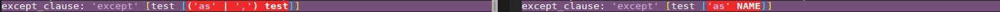

No more backquote syntax
------------------------

Python 3.3 or earlier

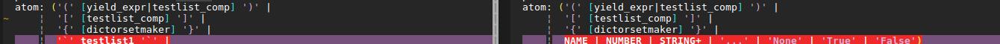

